# Reporte de análisis: Simulador de Memoria Virtual

**Curso:** Sistemas Operativos · **Laboratorio:** Memoria virtual con paginación  
**Lenguaje:** C++17 · **Políticas implementadas:** FIFO, LRU y CLOCK (bonus)  
**Integrantes:** _(completar)_

---

## 1. Resumen

Se implementó un simulador de memoria virtual con paginación de dos niveles al estilo de un x86 simplificado. Cada acceso `read` o `write` pasa por la MMU simulada. La MMU valida que la dirección pertenezca a una región reservada, la divide en `PT1 | PT2 | Offset`, recorre el directorio y la tabla de nivel 2 (creando esta última si no existe) y obtiene el marco físico. Si la página no está cargada, se produce un **fallo de página**. En ese caso se usa un marco libre o, si no hay, la política de reemplazo elige una víctima. Si la víctima está **sucia**, se escribe a swap. Después la página pedida se carga desde swap o se inicializa en cero.

Las tres políticas se compararon con cuatro cargas de trabajo y memorias de 64 a 512 marcos. Los resultados son:

- Con **localidad temporal**, LRU tiene el mejor hit rate. Con 128 marcos obtiene 84.25 %, frente a 79.44 % de FIFO: son **23 % menos fallos** y **27 % menos escrituras a swap**. CLOCK queda cerca de LRU (82.67 %) sin tener que actualizar una lista en cada acceso.
- Con **accesos uniformes** o **secuenciales** las tres políticas dan prácticamente lo mismo, porque no hay historia útil que aprovechar.
- La **anomalía de Belady** se reprodujo con la cadena clásica. FIFO pasa de 9 a 10 fallos al subir de 3 a 4 marcos. LRU baja de 10 a 8.
- El número de fallos coincide exactamente con un simulador de referencia independiente escrito en Python, en las 36 combinaciones probadas (4 trazas × 3 memorias × 3 políticas).

---

## 2. Arquitectura

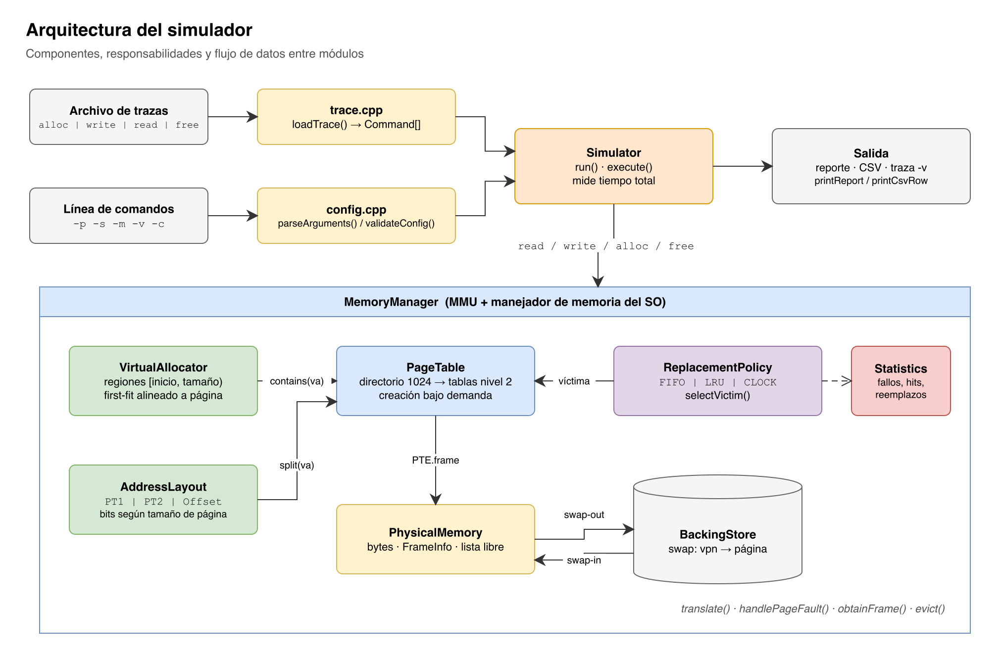

| Módulo | Archivos | Responsabilidad |
|---|---|---|
| Configuración | `config.hpp/.cpp` | Lee y valida las opciones `-p -s -m -v -c` |
| Trazas | `trace.hpp/.cpp` | Convierte el archivo de entrada en `Command[]`. Registra los errores de sintaxis por línea sin detener la simulación |
| Simulador | `simulator.hpp/.cpp` | Ejecuta los comandos, imprime la traza detallada y el reporte o CSV, y mide el tiempo total |
| MMU / SO | `memory_manager.hpp/.cpp` | `translate()`, `handlePageFault()`, `obtainFrame()`, `evict()`, `allocate()` y `release()` |
| Dirección | `address_layout.hpp/.cpp` | Calcula los bits de cada campo según el tamaño de página y hace las conversiones VA, VPN y PA |
| Tabla de páginas | `page_table.hpp/.cpp` | Directorio de nivel 1 y tablas de nivel 2 creadas bajo demanda |
| Memoria física | `physical_memory.hpp/.cpp` | Arreglo de bytes, marcos con su dueño (VPN) y lista de marcos libres |
| Swap | `backing_store.hpp/.cpp` | Guarda el contenido de las páginas expulsadas |
| Asignador virtual | `virtual_allocator.hpp/.cpp` | Regiones `alloc` y `free` con first-fit alineado a página |
| Políticas | `replacement_policy.hpp`, `fifo_policy.hpp`, `lru_policy.hpp`, `clock_policy.hpp`, `frame_list.hpp/.cpp`, `policies.cpp` | Interfaz común, las tres implementaciones y la fábrica `makePolicy()` |
| Estadísticas | `statistics.hpp` | Contadores y tiempos |
| Herramienta | `tools/gen_trace.cpp` | Genera cargas sintéticas reproducibles con semilla |

Las funciones de **traducción** (`translate`), **fallos** (`handlePageFault`, `obtainFrame`) y **reemplazo** (`evict` y cada `ReplacementPolicy::selectVictim`) están separadas, como pide el enunciado.

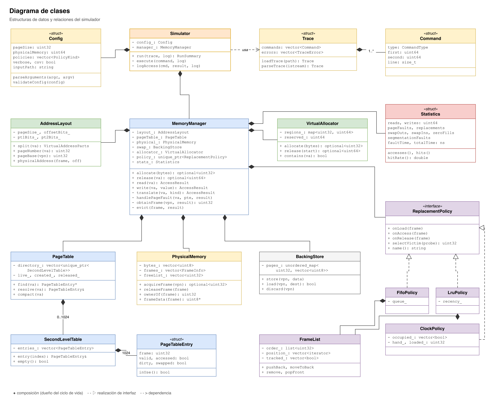

---

## 3. Estructuras de datos

### 3.1 Dirección virtual

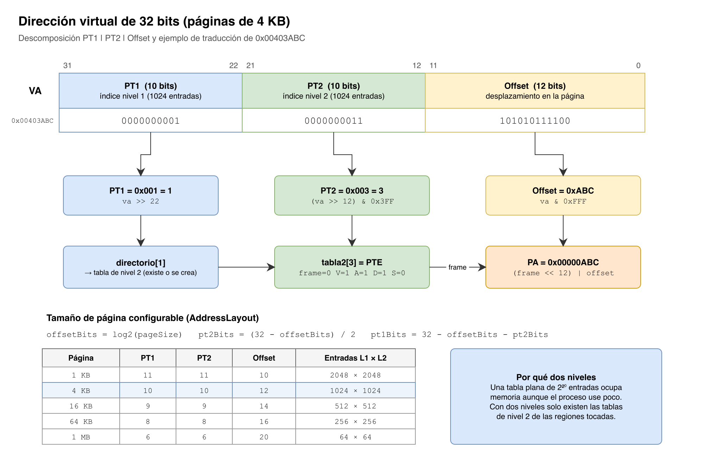

`AddressLayout` calcula los campos a partir del tamaño de página:

```
offsetBits = log2(pageSize)
pt2Bits    = (32 - offsetBits) / 2
pt1Bits    = 32 - offsetBits - pt2Bits

pt1    = va >> (offsetBits + pt2Bits)
pt2    = (va >> offsetBits) & (2^pt2Bits - 1)
offset = va & (pageSize - 1)
PA     = (frame << offsetBits) | offset
```

Con páginas de 4 KB el resultado es exactamente `10 | 10 | 12`, igual que en el enunciado. La prueba `tests/traduccion.txt` comprueba que `0x00403ABC` se divide en `pt1=1, pt2=3, off=0xABC` y que con páginas de 16 KB se divide en `pt1=0, pt2=256, off=0x3ABC`.

### 3.2 Tabla de páginas de dos niveles

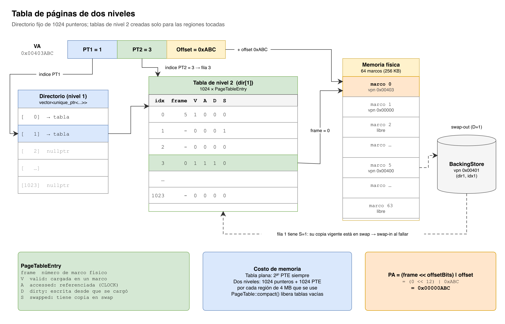

```cpp
struct PageTableEntry { uint32_t frame; bool valid, accessed, dirty, swapped; };
class SecondLevelTable { std::vector<PageTableEntry> entries_; };
class PageTable { std::vector<std::unique_ptr<SecondLevelTable>> directory_; };
```

- **Directorio (nivel 1).** Vector fijo de `2^pt1Bits` punteros inteligentes. Un `nullptr` indica que la tabla de nivel 2 no existe.
- **Nivel 2.** Se crea en `PageTable::resolve()` la primera vez que se accede a una dirección de su rango, es decir, *crear tabla nivel 2 dinámicamente si no existe*. `find()` consulta sin crear nada y la usa `evict()`.
- **Liberación.** `PageTable::compact()` destruye una tabla de nivel 2 cuando ninguna de sus entradas está en uso (`valid || swapped`) después de un `free`.
- **PTE.** `frame` es el número de marco. `valid` indica que la página está en RAM. `accessed` es el bit de referencia (lo usa CLOCK). `dirty` indica que la página se escribió desde que se cargó. `swapped` indica que hay una copia vigente en swap.
- **Costo.** Una tabla plana necesitaría 2²⁰ PTE aunque el proceso usara una sola página. Con dos niveles solo se paga el directorio (1024 punteros) más 1024 PTE por cada bloque de 4 MB que se toque. Por ejemplo, la traza de localidad (1024 páginas = 4 MB) crea **una sola** tabla de nivel 2.

### 3.3 Memoria física, swap y regiones

- `PhysicalMemory` guarda un `std::vector<uint8_t>` de `physicalMemory` bytes, un `FrameInfo{used, pageNumber}` por marco (la *tabla de marcos invertida*, que permite saber a qué PTE pertenece una víctima) y una pila de marcos libres, todo en O(1).
- `BackingStore` es un `unordered_map<vpn, vector<uint8_t>>` que simula el disco. Solo se escribe al expulsar una página **sucia**. Si la página está limpia y ya tiene copia (`swapped=1`), la copia sigue siendo válida y no hace falta E/S.
- `VirtualAllocator` es un `std::map<inicio, tamaño>`. `alloc` redondea al tamaño de página y usa first-fit desde la dirección 0 (así `alloc 8192` devuelve `0x00000000`, como en el ejemplo del enunciado). `contains(va)` cuesta O(log n) y sirve para detectar **segfaults**. `free` solo acepta el inicio exacto de una región. Libera sus marcos, descarta su swap y compacta las tablas. Si la región se vuelve a asignar, se entrega en cero, así que no se filtran datos de un uso anterior.

### 3.4 Ciclo de vida de una página

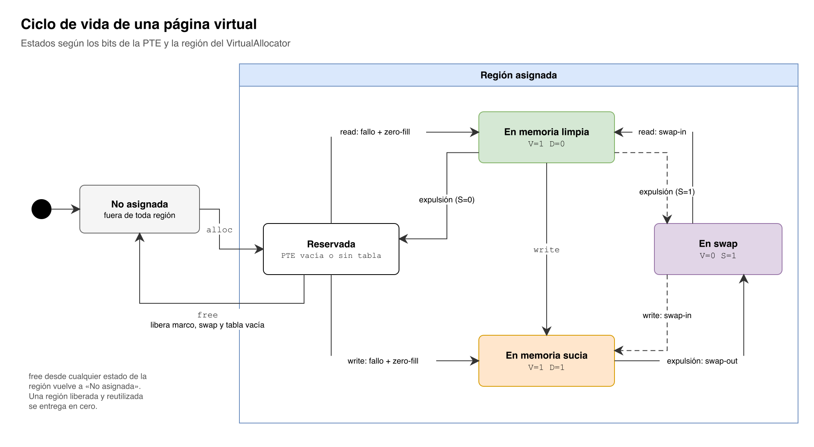

---

## 4. Traducción y manejo de fallos

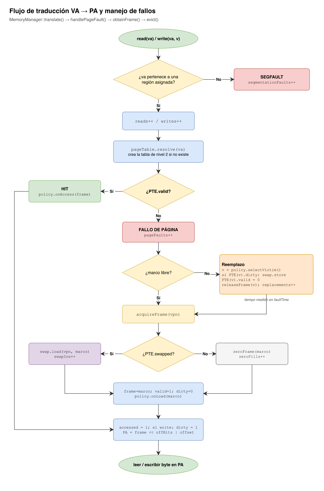

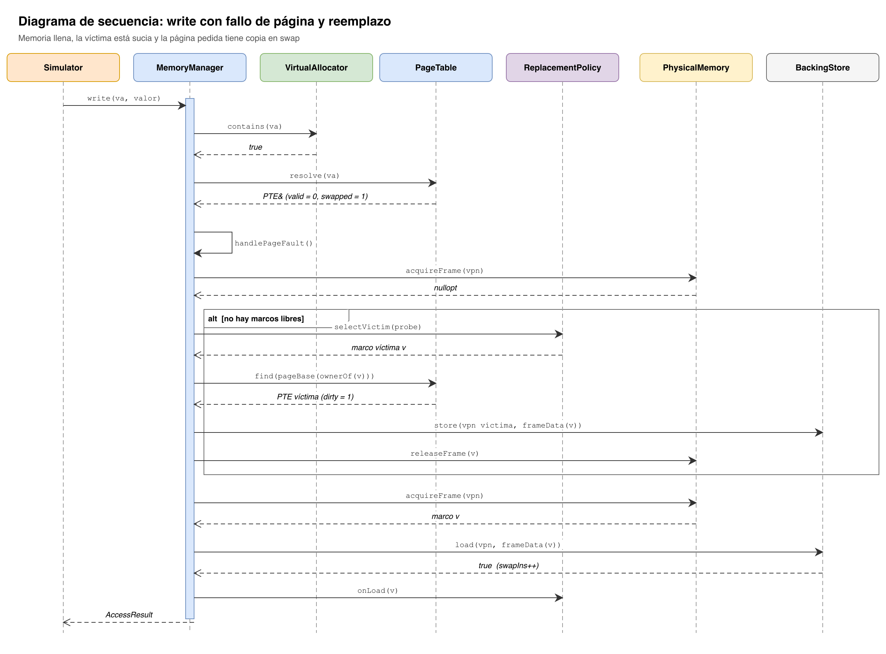

Puntos importantes de `MemoryManager`:

1. **Validación.** Si `va` no pertenece a ninguna región, la operación termina con `SEGFAULT`. No cuenta como acceso ni como fallo de página; se registra aparte en `segmentationFaults`.
2. **Hit.** Si `valid=1`, se llama `policy.onAccess(frame)`. LRU mueve el marco al final de su lista; FIFO y CLOCK no hacen nada.
3. **Fallo.** Se incrementa `pageFaults` y se mide el tiempo del manejo (`faultTime`).
4. **Obtener marco.** Si hay un marco libre se usa. Si no, `selectVictim(probe)` elige la víctima. `probe` es una función que lee y limpia el bit `accessed` de la PTE dueña del marco, y la usa CLOCK. `evict()` hace swap-out si la víctima está sucia, marca `valid=0` e incrementa `replacements`.
5. **Cargar.** Si la PTE tiene `swapped=1`, se copia desde swap (`swapIns`). Si no, la página se llena de ceros (`zeroFills`).
6. **Finalizar.** Se pone `accessed=1`, y también `dirty=1` si la operación es de escritura. La dirección física es `PA = frame << offsetBits | offset`.

Por definición, **Hit rate = (N − M) / N × 100**, donde N = lecturas + escrituras válidas y M = fallos de página.

---

## 5. Políticas de reemplazo

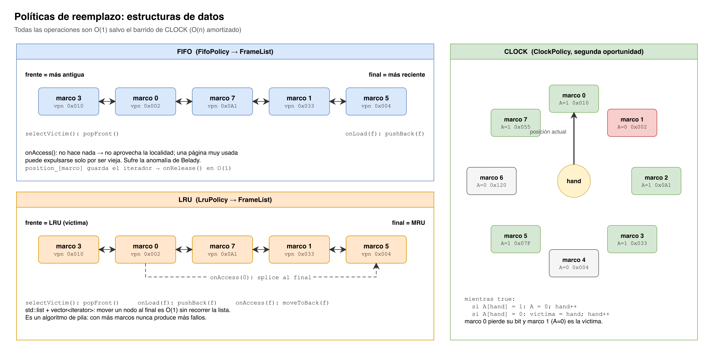

| | FIFO | LRU | CLOCK |
|---|---|---|---|
| Criterio | La página que lleva más tiempo cargada | La página usada hace más tiempo | La primera con `A=0` en el barrido circular |
| Estructura | `FrameList`: `std::list` + `vector<iterator>` | La misma `FrameList` | `vector<bool>` + manecilla + bit `accessed` de la PTE |
| `onLoad` | `pushBack` O(1) | `pushBack` O(1) | marca ocupado O(1) |
| `onAccess` | nada | `moveToBack` (splice) O(1) | nada (el bit A lo pone la MMU) |
| `onRelease` (`free`) | `remove` O(1) | `remove` O(1) | desmarca O(1) |
| `selectVictim` | `popFront` O(1) | `popFront` O(1) | O(n) peor caso, O(1) amortizado |
| Anomalía de Belady | Sí | No (algoritmo de pila) | Sí |
| Costo en hardware real | Mínimo | Alto: actualizar orden en cada acceso | Bajo: solo el bit de referencia |

**FIFO.** Es simple y determinista, pero ignora el uso: una página muy usada puede salir solo porque llegó primero.

**LRU.** Aproxima al algoritmo óptimo de Belady usando el pasado reciente como predictor del futuro próximo, lo que funciona bien con localidad temporal. La lista doblemente enlazada junto con el vector de iteradores evita buscar el marco: `std::list::splice` lo mueve al final en O(1).

**CLOCK (segunda oportunidad).** Aproxima LRU con un solo bit por página, que es lo que usan los sistemas operativos reales. La manecilla recorre los marcos: si `A=1`, lo pone en 0 y sigue; si `A=0`, ese marco es la víctima.

`FrameList` guarda en `position_[marco]` el iterador de cada nodo. Así `free` puede quitar un marco de la política en O(1) sin recorrer la lista.

---

## 6. Programas de prueba y resultados

### 6.1 Cargas de trabajo

| Traza | Generación | Páginas | Accesos | Qué ejercita |
|---|---|---|---|---|
| `basico.txt` | Enunciado | 2 | 4 | Caso mínimo |
| `belady.txt` | Manual (páginas de 128 KB) | 5 | 12 | Anomalía de Belady |
| `liberacion.txt` | Manual | 4 | 8 | `free`, reutilización, segfault, errores de sintaxis |
| `swap.txt` | Manual | 100 | 112 | Integridad de datos a través de swap-out y swap-in |
| `secuencial.txt` | `gen_trace seq 512 40000` | 512 | 40 000 | Recorrido lineal en ráfagas de 16 accesos por página |
| `aleatorio.txt` | `gen_trace random 512 40000` | 512 | 40 000 | Accesos uniformes, sin localidad |
| `localidad.txt` | `gen_trace locality 1024 100000` | 1024 | 100 000 | 50 % en 3 páginas calientes, 40 % en una ventana del 10 % y 10 % al azar. La ventana cambia 20 veces |
| `matrices.txt` | `gen_trace matrix 768 150000` | 768 | 150 000 | `C[i][j] += A[i][k]·B[k][j]` con matrices de 96×96 repartidas en 256 páginas cada una |

En las trazas generadas, el 30 % de los accesos son escrituras y el primer acceso a cada página siempre es una escritura.

### 6.2 Ejemplo del enunciado

```
Total de accesos: 4
Total fallos de página: 2
Hit rate: 50.00%
Total reemplazos: 0
Política: FIFO
```

Los dos `write` producen fallos (se cargan y se llenan con ceros). Los dos `read` son hits y devuelven 42 y 99.

### 6.3 Resultados con 64, 128 y 256 marcos (páginas de 4 KB)

**Localidad temporal (1024 páginas, 100 000 accesos)**

| Marcos | Política | Fallos | Hit rate | Reemplazos | Swap-out |
|---|---|---:|---:|---:|---:|
| 64 | FIFO | 32 469 | 67.53 % | 32 405 | 14 699 |
| 64 | LRU | **30 048** | **69.95 %** | 29 984 | **12 763** |
| 64 | CLOCK | 30 495 | 69.51 % | 30 431 | 13 014 |
| 128 | FIFO | 20 560 | 79.44 % | 20 432 | 11 367 |
| 128 | LRU | **15 749** | **84.25 %** | 15 621 | **8 337** |
| 128 | CLOCK | 17 330 | 82.67 % | 17 202 | 9 292 |
| 256 | FIFO | 12 004 | 88.00 % | 11 748 | 7 122 |
| 256 | LRU | **9 237** | **90.76 %** | 8 981 | **4 771** |
| 256 | CLOCK | 9 527 | 90.47 % | 9 271 | 5 012 |

**Multiplicación de matrices (768 páginas, 150 000 accesos)**

| Marcos | Política | Fallos | Hit rate | Reemplazos | Swap-out |
|---|---|---:|---:|---:|---:|
| 64 | FIFO | 52 566 | 64.96 % | 52 502 | 17 832 |
| 64 | LRU | **51 766** | **65.49 %** | 51 702 | 17 031 |
| 64 | CLOCK | **51 766** | **65.49 %** | 51 702 | 17 032 |
| 128 | FIFO | 1 554 | 98.96 % | 1 426 | 1 426 |
| 128 | LRU | **1 503** | **99.00 %** | 1 375 | 1 375 |
| 128 | CLOCK | 1 613 | 98.92 % | 1 485 | 1 485 |
| 256 | FIFO | 1 511 | 98.99 % | 1 255 | 1 255 |
| 256 | LRU | 1 503 | 99.00 % | 1 247 | 1 247 |
| 256 | CLOCK | **1 333** | **99.11 %** | 1 077 | 1 077 |

**Aleatorio uniforme (512 páginas, 40 000 accesos)**

| Marcos | FIFO | LRU | CLOCK |
|---|---:|---:|---:|
| 64 | 12.38 % | 12.34 % | 12.35 % |
| 128 | 24.82 % | 24.83 % | 24.86 % |
| 256 | 50.15 % | 49.77 % | 49.71 % |

**Secuencial (512 páginas en ráfagas de 16):** las tres políticas dan 93.75 % en todos los tamaños hasta 384 marcos (2 500 fallos, uno por ráfaga) y 98.72 % con 512 marcos.

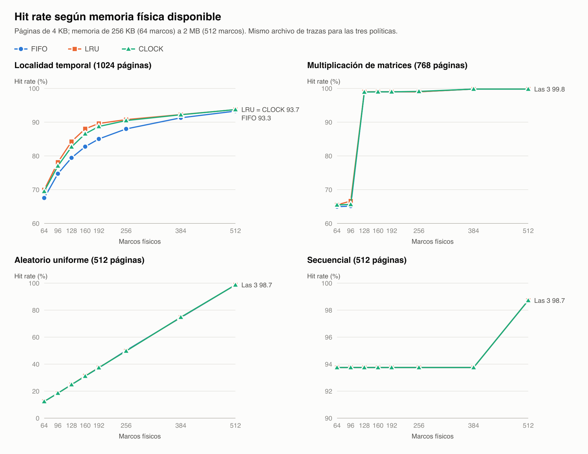

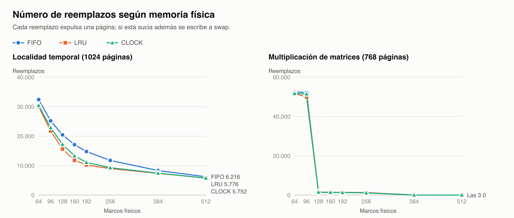

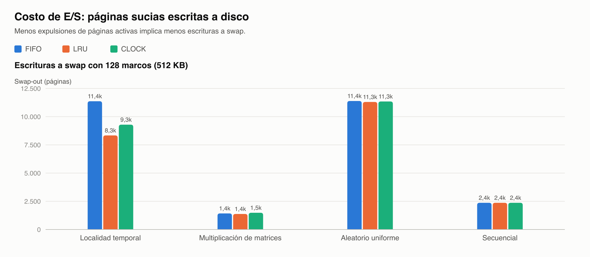

### 6.4 Anomalía de Belady

Cadena de referencias `1 2 3 4 1 2 5 1 2 3 4 5` (`tests/belady.txt`). Se usan páginas de 128 KB para poder tener 3 y 4 marcos (384 KB y 512 KB) sin bajar del mínimo de 256 KB.

| Marcos | FIFO | LRU | CLOCK |
|---|---:|---:|---:|
| 3 | 9 | 10 | 9 |
| 4 | **10** ↑ | 8 ↓ | **10** ↑ |

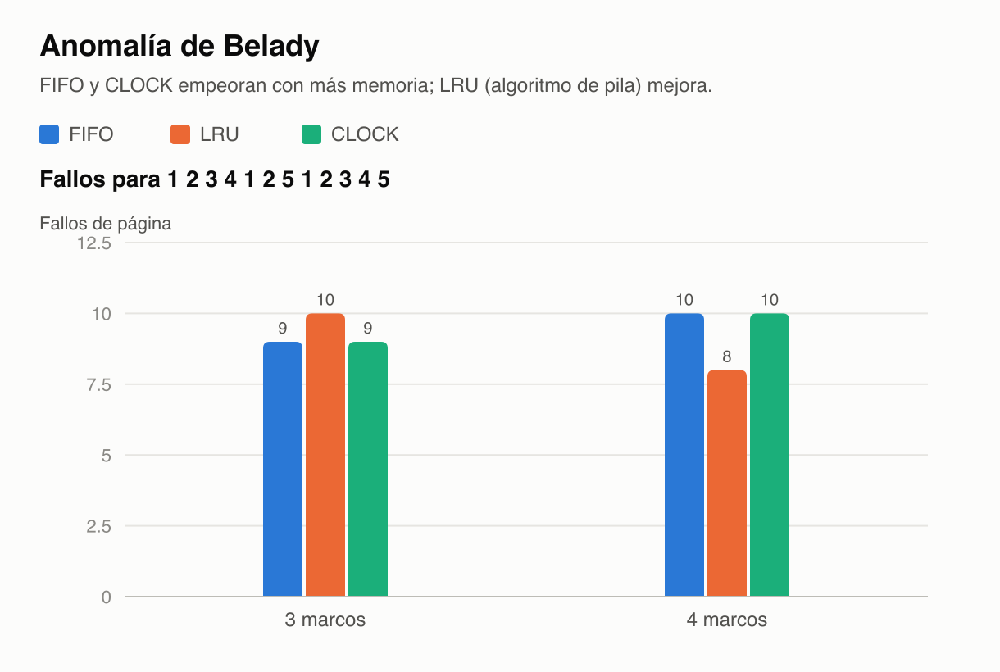

### 6.5 Efecto del tamaño de página

Con la memoria fija en 1 MB y la traza de localidad, se pasó de 256 marcos de 4 KB a 16 marcos de 64 KB:

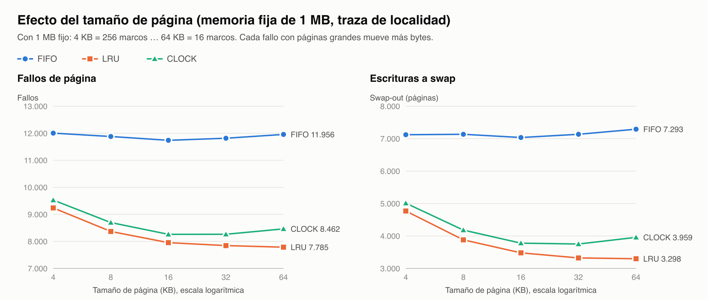

Las páginas grandes abarcan más direcciones vecinas, lo que aprovecha la localidad espacial. Por eso LRU baja de 9 237 a 7 785 fallos aunque tenga 16 veces menos marcos. FIFO no mejora (≈12 000 fallos): su error es expulsar páginas calientes, y con menos marcos cada error pesa más. El costo es que cada fallo copia o pone en cero 16 veces más bytes, y en un sistema real la fragmentación interna también crece.

---

## 7. Análisis

### 7.1 Cambio del hit rate

1. **Más memoria mejora el hit rate con cualquier política,** pero de forma distinta según la carga. En la carga aleatoria el hit rate crece casi linealmente con los marcos (hit ≈ marcos / páginas), porque ninguna página es más probable que otra. En la de localidad la curva es cóncava: los primeros marcos cubren el conjunto de trabajo y después hay rendimientos decrecientes.
2. **El conjunto de trabajo manda.** En la multiplicación de matrices el hit rate salta de 65 % a 99 % al pasar de 96 a 128 marcos. Con `order = 96`, un ciclo interno `k` toca una fila de A (~3 páginas), una columna de B (repartida en ~96 páginas, una por fila) y una celda de C. Cuando la memoria alcanza para ese conjunto de trabajo (~100 páginas), el *thrashing* desaparece. Por debajo de ese umbral ninguna política lo evita: las tres quedan en 65 %.
3. **LRU saca ventaja cuando hay localidad y la memoria es escasa respecto al conjunto de trabajo.** En la traza de localidad con 128 marcos, LRU tiene 4 811 fallos menos que FIFO (−23 %). La ventaja se reduce cuando sobra memoria (512 marcos: 93.7 % frente a 93.3 %) y cuando falta del todo (64 marcos: 69.9 % frente a 67.5 %).
4. **Sin localidad las políticas son equivalentes.** Con la carga aleatoria las diferencias son menores a 0.5 puntos y cambian de signo: el pasado no predice el futuro, así que ordenar por antigüedad o por uso da lo mismo. Con la secuencial pasa algo parecido: cada página se usa en una ráfaga y no vuelve hasta la siguiente vuelta, así que la menos reciente y la más antigua son la misma página. Los resultados son idénticos.

### 7.2 Número de reemplazos

- Con memoria llena, `reemplazos = fallos − marcos`, porque cada fallo después del llenado expulsa una página. Por eso las curvas de reemplazos siguen a las de fallos.
- Lo que realmente cuesta E/S es el **swap-out**, es decir, los reemplazos de páginas sucias. En la traza de localidad con 128 marcos, LRU escribe 8 337 páginas y FIFO 11 367 (**+36 %**). FIFO expulsa páginas calientes, que suelen estar sucias, y luego tiene que volver a leerlas (swap-in).
- En la carga secuencial hay 1 988 swap-ins con cualquier política: cada vuelta completa sobre las 512 páginas vuelve a leer las que fueron expulsadas.

### 7.3 Tiempo de acceso efectivo

Con un acceso a RAM de 100 ns y un fallo servido desde disco en 8 ms, `EAT = (1 − p)·100 ns + p·8 ms`. Para la traza de localidad con 128 marcos:

| Política | Tasa de fallos p | EAT |
|---|---:|---:|
| FIFO | 20.56 % | ≈ 1.645 ms |
| CLOCK | 17.33 % | ≈ 1.386 ms |
| LRU | 15.75 % | ≈ 1.260 ms |

El tiempo lo domina completamente la tasa de fallos: bajar 5 puntos porcentuales hace el sistema un 23 % más rápido. El tiempo de CPU del simulador (≈ 300 ns por fallo) es insignificante comparado con el de una E/S real.

---

## 8. Comparación teórica FIFO frente a LRU

| Aspecto | FIFO | LRU |
|---|---|---|
| Información que usa | Solo el orden de carga | Orden del último uso |
| Supuesto | Lo que llegó primero ya no se necesita | Lo usado recientemente se volverá a usar (localidad temporal) |
| Cercanía al óptimo | Lejana: puede expulsar la página más usada | Cercana: es el "óptimo mirando hacia atrás" |
| Propiedad de pila | No: sufre la anomalía de Belady (demostrada en 6.4) | Sí: el conjunto con *n* marcos está contenido en el de *n+1*, así que más memoria nunca da más fallos |
| Costo por acceso | Ninguno | Actualizar el orden en **cada** acceso. En software es O(1) con lista + hash. En hardware requiere contadores o pilas por referencia, lo que es inviable a la velocidad de la MMU |
| Costo por fallo | O(1) | O(1) |
| Memoria extra | Cola de marcos | Lista + índice por marco |
| Uso real | Rara vez solo; es la base de *second chance* | Se aproxima con CLOCK, CLOCK-Pro, listas activas e inactivas (Linux) o *aging* |

**Conclusión teórica.** LRU domina a FIFO siempre que el programa tenga localidad, que es el caso normal. FIFO solo empata cuando los accesos son uniformes o estrictamente secuenciales. Como el LRU exacto es caro en hardware, los sistemas reales usan aproximaciones como CLOCK. Los resultados lo confirman: CLOCK queda a 1.6 puntos de LRU en localidad y a 0.3 puntos con 256 marcos, sin tocar ninguna estructura en los hits.

---

## 9. Calidad del código

- **Compilación:** `-std=c++17 -Wall -Wextra -Wpedantic -Wshadow -Wconversion -Werror`, sin warnings.
- **Memoria:** no hay `new` ni `delete` manuales. Todo usa RAII (`std::vector`, `std::unique_ptr`, `std::map`, `std::unordered_map`), y `MemoryManager` no es copiable.
  - `make leaks` (macOS `leaks --atExit`): `0 leaks for 0 total leaked bytes`.
  - `make sanitize` (AddressSanitizer + UndefinedBehaviorSanitizer): las 33 pruebas pasan sin reportes.
  - En Linux, `make leaks` usa `valgrind --leak-check=full`.
- **Pruebas:** `make test` corre 33 pruebas. Incluye la comparación contra `tests/referencia.py`, un simulador escrito desde cero en Python que da exactamente los mismos fallos en 36 configuraciones.
- **Errores:** las líneas inválidas de la traza se reportan con su número y se omiten. Los `free` inválidos, los accesos fuera de región y las configuraciones inválidas (memoria < 256 KB, página que no es potencia de 2, memoria que no es múltiplo de la página, archivo inexistente) terminan con un mensaje y un código de salida distinto de 0.

## 10. Bonus

- **Políticas adicionales:** CLOCK además de FIFO y LRU, seleccionables con `-p` o todas juntas con `-p all`.
- **Visualización:** modo `-v` con la descomposición de bits, la PA, el marco, HIT o FALLO, swap-in y la víctima de cada acceso. Además, 8 diagramas `.drawio` y 5 gráficas generadas a partir de los CSV.
- **Stress testing:** `gen_trace` con 4 patrones y semilla, barridos de memoria de 64 a 512 marcos y trazas de hasta 150 000 accesos.
- **Swap real:** el contenido de las páginas se conserva a través de las expulsiones (verificado en `tests/swap.txt`).

## 11. Conclusiones

1. La paginación de dos niveles permite direccionar 4 GB pagando solo por las regiones usadas. En todas las pruebas bastó una tabla de nivel 2.
2. La tasa de fallos determina el rendimiento. Depende sobre todo de que la memoria alcance para el conjunto de trabajo, y solo después de la política de reemplazo.
3. Cuando hay localidad y la memoria es justa, LRU reduce hasta un 23 % los fallos y un 27 % las escrituras a swap frente a FIFO. Sin localidad no hay diferencia.
4. FIFO sufre la anomalía de Belady; LRU no, por ser un algoritmo de pila.
5. CLOCK logra casi el mismo resultado que LRU con el costo de FIFO, y por eso es la base de los sistemas operativos reales.

## Referencias

- Arpaci-Dusseau, R. & A. *Operating Systems: Three Easy Pieces*. Capítulos 18 (Paging), 19 (TLBs), 20 (Advanced Page Tables), 21–22 (Swapping: Mechanisms & Policies).
- Silberschatz, Galvin, Gagne. *Operating System Concepts*, cap. 10 (Virtual Memory).
- Belady, L. A. (1969). "An anomaly in space-time characteristics of certain programs running in a paging machine". *CACM* 12(6).
